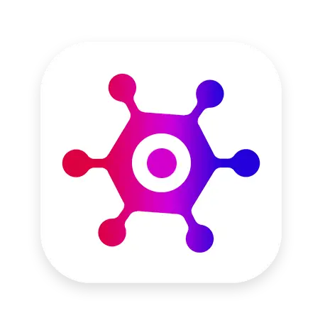

<p align="center">
  
</p>

<h1 align="center">GameHub</h1>

<p align="center">
  <strong>A modern video game discovery platform</strong>
  <br />
  Browse, search, and explore thousands of games from a unified interface.
</p>

<p align="center">
  
  
  
  
  
  
  
  <br />
  
  
  
</p>

---

## Table of Contents

- [Overview](#overview)
- [Problem Statement](#problem-statement)
- [Features](#features)
- [Screenshots](#screenshots)
- [Tech Stack](#tech-stack)
- [Architecture](#architecture)
- [Project Structure](#project-structure)
- [Component Tree](#component-tree)
- [Data Flow](#data-flow)
- [API Reference](#api-reference)
- [Getting Started](#getting-started)
- [Environment Variables](#environment-variables)
- [Running Locally](#running-locally)
- [Development Workflow](#development-workflow)
- [Build & Deployment](#build--deployment)
- [Security](#security)
- [Limitations & Known Issues](#limitations--known-issues)
- [Roadmap](#roadmap)
- [Contributing](#contributing)
- [FAQ](#faq)
- [License](#license)
- [Acknowledgements](#acknowledgements)

---

## Overview

**GameHub** is a single-page application (SPA) that provides a fast, modern interface for discovering video games. It consumes the [RAWG Video Games Database API](https://rawg.io/apidocs) — the largest open video game database — to surface game data including descriptions, ratings, screenshots, trailers, platforms, genres, and publishers.

Built with **React 18**, **TypeScript**, and **Vite**, GameHub focuses on delivering a polished browsing experience with real-time search, multi-dimensional filtering, infinite scroll, and smooth responsive layouts.

> **Note:** GameHub is a frontend-only application. It has no backend server, database, or user authentication. All data is fetched directly from the RAWG API on the client side.

---

## Problem Statement

The video game landscape is vast — thousands of new titles release every year across multiple platforms (PC, PlayStation, Xbox, Nintendo, mobile, etc.). Existing discovery tools are often:

- **Platform-specific** — tied to a single store (Steam, Epic, PlayStation Store)
- **Slow** — heavy pages with poor loading UX
- **Cluttered** — ads, reviews, and social features competing with discovery
- **Inflexible** — limited filtering, sorting, and search capabilities

GameHub solves this by providing a **unified, lightweight, and distraction-free** game browser powered by the comprehensive RAWG database.

---

## Features

### Core

| Feature | Status | Description |
|---------|--------|-------------|
| Game Browsing | ✅ Implemented | Infinite-scroll grid of game cards |
| Genre Filtering | ✅ Implemented | Filter by genre (Action, RPG, Shooter, etc.) |
| Platform Filtering | ✅ Implemented | Filter by platform family (PC, PlayStation, Xbox, etc.) |
| Sorting | ✅ Implemented | Sort by relevance, name, release date, popularity, rating |
| Search | ✅ Implemented | Real-time game search with debounced input |
| Game Details | ✅ Implemented | Detail page with description, screenshots, trailer, attributes |
| Dark Mode | ✅ Implemented | Toggle between light and dark themes |
| Responsive Design | ✅ Implemented | Mobile-friendly with adaptive grid layout |

### Detail View

- **Expandable description** — long descriptions truncated with "Read More" toggle
- **Game trailers** — embedded video player with poster
- **Screenshots gallery** — grid of game screenshots
- **Game attributes** — platforms, Metacritic score, genres, publishers
- **Emoji indicators** — visual rating cues (meh, recommended, exceptional)
- **Platform icons** — recognizable icons for each platform family

### UX

- Loading skeletons during data fetch
- Error boundaries with user-friendly messages
- Hover scale animation on game cards
- Infinite scroll pagination
- Route-based navigation with browser back/forward support

---

## Screenshots

<!-- Screenshots should be added to `src/assets/screenshots/` -->

| Home Page (Light) | Home Page (Dark) | Game Detail |
|:---:|:---:|:---:|
| `[screenshot needed]` | `[screenshot needed]` | `[screenshot needed]` |

---

## Tech Stack

### Frontend

| Technology | Version | Purpose |
|------------|---------|---------|
| [React](https://react.dev/) | 18.2 | UI library |
| [TypeScript](https://www.typescriptlang.org/) | 5.x | Type safety |
| [Vite](https://vitejs.dev/) | 4.x | Build tool & dev server |
| [Chakra UI](https://chakra-ui.com/) | 2.5 | Component library & theming |
| [TanStack React Query](https://tanstack.com/query/v4) | 4.28 | Server state management & caching |
| [Zustand](https://github.com/pmndrs/zustand) | 4.3 | Client state management |
| [React Router](https://reactrouter.com/) | 6.10 | Routing & navigation |
| [Axios](https://axios-http.com/) | 1.3 | HTTP client |
| [Framer Motion](https://www.framer.com/motion/) | 10.0 | Animations |
| [React Icons](https://react-icons.github.io/react-icons/) | 4.7 | Icon library |
| [react-infinite-scroll-component](https://github.com/ankeetmaini/react-infinite-scroll-component) | 6.1 | Infinite scroll |

### API

| Service | Type | Description |
|---------|------|-------------|
| [RAWG API](https://rawg.io/apidocs) | External REST API | Video games database (500k+ games) |

### Development

| Tool | Purpose |
|------|---------|
| ESLint (typescript-eslint) | Code linting |
| TypeScript | Type checking |

---

## Architecture

GameHub follows a **Component-Based Architecture** with clear separation of concerns:

```
┌─────────────────────────────────────────────────────┐
│                    Browser                           │
│  ┌───────────────────────────────────────────────┐  │
│  │            React Application                   │  │
│  │  ┌─────────┐  ┌──────────┐  ┌─────────────┐  │  │
│  │  │  Pages  │  │Components│  │   Hooks     │  │  │
│  │  ├─────────┤  ├──────────┤  ├─────────────┤  │  │
│  │  │ HomePage│  │ GameCard │  │ useGames    │  │  │
│  │  │ GameDtl │  │ GenreList│  │ useGenres   │  │  │
│  │  │ Layout  │  │ NavBar   │  │ useGame     │  │  │
│  │  │ ErrPage │  │ ...      │  │ usePlatforms│  │  │
│  │  └─────────┘  └──────────┘  └──────┬──────┘  │  │
│  │                                     │         │  │
│  │  ┌──────────────────────────────────┘         │  │
│  │  │  ┌──────────┐  ┌──────────────────────┐   │  │
│  │  │  │ Services │  │   State (Zustand)    │   │  │
│  │  │  ├──────────┤  ├──────────────────────┤   │  │
│  │  │  │ api-clnt │  │ GameQueryStore       │   │  │
│  │  │  │ image-url│  │  genreId, platformId │   │  │
│  │  │  └────┬─────┘  │  sortOrder, searchTxt│   │  │
│  │  │       │        └──────────────────────┘   │  │
│  │  │  ┌────▼─────┐                              │  │
│  │  │  │  Axios   │                              │  │
│  │  │  └────┬─────┘                              │  │
│  │  │       │                                     │  │
│  └──┼───────┼─────────────────────────────────────┘  │
│     │       │                                         │
│  ┌──▼───────▼──────────────────────────────────────┐  │
│  │            RAWG API (rawg.io)                    │  │
│  │  /games  /genres  /platforms  /screenshots      │  │
│  └──────────────────────────────────────────────────┘  │
└─────────────────────────────────────────────────────────┘
```

### Key Architectural Decisions

1. **React Query for Server State** — All API data is managed through React Query, providing automatic caching, background refetching, and deduplication out of the box.

2. **Zustand for Client State** — The GameQuery (filter/sort/search parameters) is held in a lightweight Zustand store, separate from server data.

3. **Generic API Client** — The `APIClient<T>` class provides typed, reusable HTTP methods for all endpoints.

4. **Custom Hooks as Data Adapters** — Each data domain (games, genres, platforms, screenshots, trailers) has a dedicated hook that encapsulates query logic.

5. **Static Initial Data** — Genres and platforms are shipped with pre-bundled static data (`src/data/`) to eliminate initial loading flash.

6. **Image Cropping Utility** — A utility function crops RAWG images to 600×400 to reduce payload size.

---

## Project Structure

```
game-hub/
├── public/
│   └── vite.svg                 # App favicon
├── src/
│   ├── assets/                  # Static assets (images, icons)
│   │   ├── logo.webp
│   │   ├── bulls-eye.webp
│   │   ├── meh.webp
│   │   ├── thumbs-up.webp
│   │   └── no-image-placeholder.webp
│   ├── components/              # Reusable UI components
│   │   ├── ColorModeSwitch.tsx       # Dark mode toggle
│   │   ├── CriticScore.tsx           # Metacritic badge
│   │   ├── DefinitionItem.tsx        # Key-value pair display
│   │   ├── Emoji.tsx                 # Rating emoji indicator
│   │   ├── ExpandableText.tsx        # Truncated text with toggle
│   │   ├── GameAttributes.tsx        # Game metadata display
│   │   ├── GameCard.tsx              # Individual game card
│   │   ├── GameCardContainer.tsx     # Card wrapper (hover effect)
│   │   ├── GameCardSkeleton.tsx      # Loading skeleton
│   │   ├── GameGrid.tsx              # Infinite scroll grid
│   │   ├── GameHeading.tsx           # Dynamic page heading
│   │   ├── GameScreenshots.tsx       # Screenshot gallery
│   │   ├── GameTrailer.tsx           # Video trailer player
│   │   ├── GenreList.tsx             # Genre sidebar
│   │   ├── NavBar.tsx                # Top navigation bar
│   │   ├── PlatformIconList.tsx      # Platform icon row
│   │   ├── PlatformSelector.tsx      # Platform dropdown
│   │   ├── SearchInput.tsx           # Search form
│   │   └── SortSelector.tsx          # Sort dropdown
│   ├── data/                    # Static fallback data
│   │   ├── genres.ts                 # Pre-bundled genre list
│   │   └── platforms.ts              # Pre-bundled platform list
│   ├── entities/                # TypeScript interfaces (models)
│   │   ├── Game.ts
│   │   ├── Genre.ts
│   │   ├── Platform.ts
│   │   ├── Publisher.ts
│   │   ├── Screenshot.ts
│   │   └── Trailer.ts
│   ├── hooks/                   # Custom React hooks
│   │   ├── useData.ts                # Generic data fetcher hook
│   │   ├── useGame.ts                # Single game query
│   │   ├── useGames.ts               # Infinite games query
│   │   ├── useGenre.ts               # Single genre lookup
│   │   ├── useGenres.ts              # Genre list query
│   │   ├── usePlatform.ts            # Single platform lookup
│   │   ├── usePlatforms.ts           # Platform list query
│   │   ├── useScreenshots.ts         # Screenshot query
│   │   └── useTrailers.ts            # Trailer query
│   ├── pages/                   # Route-level page components
│   │   ├── ErrorPage.tsx
│   │   ├── GameDetailPage.tsx
│   │   ├── HomePage.tsx
│   │   └── Layout.tsx
│   ├── services/                # Infrastructure layer
│   │   ├── api-client.ts             # Axios instance & APIClient class
│   │   └── image-url.ts              # Image cropping utility
│   ├── App.css                  # (empty - unused)
│   ├── App.tsx                  # Root app component
│   ├── index.css                # Global styles
│   ├── main.tsx                 # Application entry point
│   ├── routes.tsx               # Route definitions
│   ├── store.ts                 # Zustand game query store
│   ├── theme.ts                 # Chakra UI theme customization
│   └── vite-env.d.ts            # Vite type declarations
├── index.html                   # HTML entry point
├── package.json                 # Dependencies & scripts
├── tsconfig.json                # TypeScript configuration
├── tsconfig.app.json            # TypeScript app configuration
├── tsconfig.node.json           # TypeScript Node configuration
├── vite.config.ts               # Vite configuration
├── eslint.config.js             # ESLint flat config
└── .gitignore
```

---

## Component Tree

```
<App> (or <RouterProvider>)
├── <Layout>
│   ├── <NavBar>
│   │   ├── <Logo> (Image)
│   │   ├── <SearchInput>
│   │   └── <ColorModeSwitch>
│   └── <Outlet>
│       ├── <HomePage>
│       │   ├── <GenreList>
│       │   │   └── <GenreItem> × N
│       │   ├── <GameHeading />
│       │   ├── <PlatformSelector />
│       │   ├── <SortSelector />
│       │   └── <GameGrid>
│       │       └── <InfiniteScroll>
│       │           └── <GameCardContainer>
│       │               └── <GameCard>
│       │                   ├── <Image>
│       │                   ├── <PlatformIconList />
│       │                   ├── <CriticScore />
│       │                   ├── <GameTitle> (Link)
│       │                   └── <Emoji />
│       └── <GameDetailPage>
│           ├── <Heading>
│           ├── <ExpandableText>
│           ├── <GameAttributes>
│           │   ├── <DefinitionItem> × 4
│           │   └── <CriticScore>
│           ├── <GameTrailer>
│           └── <GameScreenshots>
│               └── <Image> × N
└── <ErrorPage>
    └── <NavBar>
```

---

## Data Flow

```
User Action                    Store Update                   Query Invalidation
─────────────                  ────────────                   ─────────────────
Select Genre    ──► setGenreId(id)     ──► React Query key changes
Select Platform ──► setPlatformId(id)  ──► React Query key changes
Sort            ──► setSortOrder(val)  ──► React Query key changes
Search          ──► setSearchText(val) ──► React Query key changes
                                                              │
                                                              ▼
                                                        API Call
                                                     (useGames hook)
                                                              │
                                                              ▼
                                                     GameGrid re-renders
                                                     with new results
```

---

## API Reference

GameHub relies on the [RAWG API](https://rawg.io/apidocs). Only public endpoints are used (no authentication required beyond the API key).

### Endpoints Used

| Endpoint | Method | Hook | Purpose |
|----------|--------|------|---------|
| `/games` | GET | `useGames` | Paginated list of games with filters |
| `/games/{slug}` | GET | `useGame` | Single game details |
| `/games/{id}/screenshots` | GET | `useScreenshots` | Game screenshots |
| `/games/{id}/movies` | GET | `useTrailers` | Game trailers |
| `/genres` | GET | `useGenres` | List of game genres |
| `/platforms/lists/parents` | GET | `usePlatforms` | List of platform families |

### Query Parameters (for `/games`)

| Parameter | Type | Source | Description |
|-----------|------|--------|-------------|
| `genres` | number | Zustand store | Genre ID filter |
| `parent_platforms` | number | Zustand store | Platform ID filter |
| `ordering` | string | Zustand store | Sort order (e.g., `-metacritic`, `name`) |
| `search` | string | Zustand store | Search query |
| `page` | number | React Query | Pagination (auto-managed) |

### Rate Limiting

> **Needs Verification** — RAWG API rate limits are not documented in this codebase. Refer to [RAWG API docs](https://rawg.io/apidocs) for current limits.

---

## Getting Started

### Prerequisites

- **Node.js** ≥ 18.x (recommended)
- **npm** ≥ 9.x (or pnpm/yarn)

### Quick Start

```bash
# Clone the repository
git clone https://github.com/<your-org>/game-hub.git
cd game-hub

# Install dependencies
npm install

# Start dev server
npm run dev
```

The app will be available at `http://localhost:5173`.

---

## Environment Variables

> ⚠️ **Current State:** The RAWG API key is **hardcoded** in `src/services/api-client.ts:13`. There is no `.env` file or environment variable configuration.

```typescript
// src/services/api-client.ts (current state)
const axiosInstance = axios.create({
  baseURL: 'https://api.rawg.io/api',
  params: {
    key: '6a2cebc9036d43b5a52b15015d06e963',  // ← hardcoded
  },
});
```

**Recommended improvement** — Move the API key to an environment variable:

```bash
# .env
VITE_RAWG_API_KEY=your_api_key_here
```

---

## Running Locally

```bash
# Install dependencies
npm install

# Start development server (with HMR)
npm run dev

# Type-check the project
npx tsc --noEmit

# Lint the project
npm run lint
```

### Available Scripts

| Script | Command | Description |
|--------|---------|-------------|
| `dev` | `vite` | Start Vite dev server with HMR |
| `build` | `tsc && vite build` | Type-check and build for production |
| `preview` | `vite preview` | Preview production build locally |

> **Note:** `lint` is not defined in package.json scripts but ESLint configuration exists. Run with `npx eslint src/`.

---

## Development Workflow

1. **Pick a feature or fix** from the [Roadmap](#roadmap) or issues list
2. **Create a branch**: `git checkout -b feat/your-feature`
3. **Make changes** following existing patterns:
   - Components in `src/components/`
   - Hooks in `src/hooks/`
   - Entities in `src/entities/`
   - Services in `src/services/`
4. **Type-check**: `npx tsc --noEmit`
5. **Lint**: `npx eslint src/`
6. **Commit**: Use descriptive commit messages
7. **Push and open a PR**

### Coding Conventions

- **Components**: Arrow function components with explicit `interface Props` typing
- **State**: Zustand for client state, React Query for server state
- **API**: Use the generic `APIClient<T>` class for new endpoints
- **Styling**: Chakra UI props only (no CSS modules or styled-components)
- **Exports**: Default exports for components and hooks
- **Imports**: No barrel files; direct imports from source files

---

## Build & Deployment

### Production Build

```bash
npm run build
```

Output is written to `dist/`. The build runs TypeScript type checking before Vite bundling.

### Deployment

> **Needs Verification** — No deployment configuration is present in this repository. The `.vercel` entry in `.gitignore` suggests Vercel was used previously or is intended.

**Recommended deployment platforms:**

| Platform | Setup |
|----------|-------|
| **Vercel** | Connect Git repo → auto-detects Vite → deploys `dist/` |
| **Netlify** | Connect Git repo → build command `npm run build` → publish `dist/` |
| **Cloudflare Pages** | Connect Git repo → build command `npm run build` → output `dist/` |
| **GitHub Pages** | Add `vite-plugin-gh-pages` and configure in vite.config.ts |

**Environment variables required in production:**
- `VITE_RAWG_API_KEY` — Your RAWG API key

---

## Security

### Current State

| Concern | Status | Detail |
|---------|--------|--------|
| API Key Exposure | ❌ **Critical** | RAWG API key is hardcoded in client-side source code. Anyone can view it via browser DevTools. |
| Authentication | ⚠️ None | No user accounts, sessions, or auth of any kind |
| Input Validation | ⚠️ Basic | TypeScript types provide compile-time checks; no runtime validation |
| HTTPS | ✅ | All API calls use HTTPS |
| CSRF | ✅ N/A | No state-changing operations on the server |
| XSS | ⚠️ Acceptable | React's built-in XSS protection; no `dangerouslySetInnerHTML` usage |

### Recommendations

1. **Move API key to environment variables** (`VITE_RAWG_API_KEY`)
2. **Add a proxy server** if you need to protect the API key (currently visible in network requests)
3. **Consider API key restrictions** in the RAWG developer dashboard (domain/IP whitelist)

---

## Limitations & Known Issues

- **No backend** — API key is exposed; no user accounts or saved preferences
- **No testing** — Zero unit, integration, or E2E tests
- **No error tracking** — Console errors only (no Sentry, LogRocket, etc.)
- **No analytics** — No visibility into user behavior
- **No accessibility audit** — Not verified against WCAG standards
- **No PWA support** — No service worker, offline support, or `manifest.json`
- **No SEO** — Vite SPA without SSR/SSG; search engines may not index content
- **Hardcoded API key** — `src/services/api-client.ts:13`
- **Duplicate component** — `ColorModeSwitch.tsx` and `ColorSwitchMode.tsx` appear to be duplicates (one likely unused)
- **Empty CSS files** — `src/App.css` is empty; `src/index.css` contains only 1 rule

---

## Roadmap

### Short-term

- [ ] Move API key to environment variable
- [ ] Add unit tests (Vitest + React Testing Library)
- [ ] Remove duplicate `ColorSwitchMode` component
- [ ] Add proper error boundaries
- [ ] Add loading states for genre/platform lists

### Medium-term

- [ ] Add E2E tests (Playwright or Cypress)
- [ ] Add PWA support (service worker, offline fallback)
- [ ] Implement favorites/wishlist (localStorage)
- [ ] Improve accessibility (ARIA labels, keyboard navigation)
- [ ] Add bundle analysis (vite-bundle-analyzer)

### Long-term

- [ ] Add a lightweight backend (e.g., Express/Fastify) to proxy API and protect key
- [ ] User accounts and authentication
- [ ] Game recommendations
- [ ] Multi-language support
- [ ] Dark/light mode persistence

---

## Contributing

> **Note:** This is a personal/learning project. Contribution guidelines are not yet established.

If you'd like to contribute:

1. Fork the repository
2. Create a feature branch
3. Make your changes
4. Submit a pull request

Please ensure TypeScript type checking passes before submitting.

---

## FAQ

**Q: Why does the app use the RAWG API?**
A: RAWG is the largest open video game database with a public API, offering comprehensive game metadata including ratings, screenshots, and trailers.

**Q: Is the API key safe in the client?**
A: No. The key is visible in browser DevTools. It should be moved to an environment variable and restricted via the RAWG dashboard. For production, adding a proxy backend is recommended.

**Q: Can I add user accounts?**
A: Not currently. This would require a backend service with authentication (e.g., Auth0, Supabase, or a custom backend).

**Q: Why no tests?**
A: This project was built as a learning exercise. Tests are planned for future iterations.

**Q: How do I get my own RAWG API key?**
A: Register at [rawg.io/apidocs](https://rawg.io/apidocs) and request a free API key.

---

## License

> ⚠️ **Not specified.** No license file exists in this repository.

---

## Acknowledgements

- **RAWG** — For providing the comprehensive video games database API
- **Code with Mosh** — For the project inspiration and guided architecture
- **Chakra UI Team** — For the accessible, themeable component library
- **Tanner Linsley (TanStack)** — For React Query, which simplifies server state management
- All open-source maintainers whose libraries make this project possible

---

<p align="center">
  <sub>Built with React, TypeScript, and ❤️</sub>
</p>
